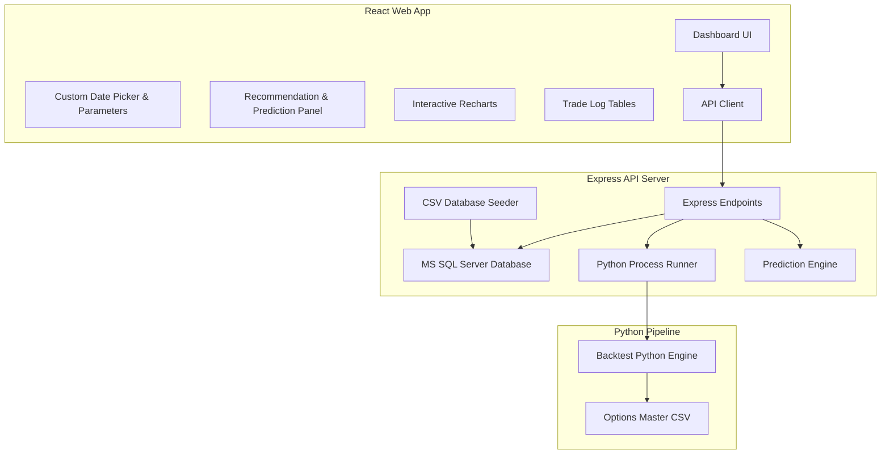

# Implementation Plan - F&O Strategy Backtester & Predictive Dashboard (MS SQL Server)

This updated plan adapts the dashboard database tier to use **Microsoft SQL Server (MSSQL)** (compatible with SQL Server Management Studio - SSMS) as requested. We will use the official `mssql` client in the Node.js backend.

## Architecture Overview



---

## SQL Server Database Configuration

We will connect to MS SQL Server using the `mssql` Node.js package. The database credentials and connection options will be configurable in a `backend/.env` file.

### Connection Parameters (`backend/.env`)
```env
PORT=5000
DB_USER=sa
DB_PASSWORD=YourPassword Here
DB_SERVER=localhost
DB_DATABASE=BacktesterDB
DB_PORT=1433
# Set true if using SQLEXPRESS instance name or Windows Auth configuration:
# DB_INSTANCE_NAME=SQLEXPRESS
```

### MS SQL Database Schema

We will write SQL scripts in the backend to automatically check and create the database and tables if they do not exist.

#### 1. Table: `strategies`
```sql
CREATE TABLE strategies (
    id VARCHAR(50) PRIMARY KEY,
    name VARCHAR(100) NOT NULL,
    description VARCHAR(MAX) NOT NULL,
    frequency VARCHAR(20) NOT NULL
);
```

#### 2. Table: `trades`
```sql
CREATE TABLE trades (
    id INT IDENTITY(1,1) PRIMARY KEY,
    strategy_id VARCHAR(50) NOT NULL,
    date VARCHAR(20) NOT NULL,
    expiry VARCHAR(20) NOT NULL,
    entry_spot FLOAT NOT NULL,
    strike FLOAT NOT NULL,
    premium_received FLOAT DEFAULT 0.0,
    premium_paid FLOAT DEFAULT 0.0,
    lot_size INT NOT NULL,
    expiry_pnl FLOAT NOT NULL,
    regime VARCHAR(50) NOT NULL,
    FOREIGN KEY(strategy_id) REFERENCES strategies(id) ON DELETE CASCADE
);
```

#### 3. Table: `daily_index`
```sql
CREATE TABLE daily_index (
    date VARCHAR(20) PRIMARY KEY,
    underlying_value FLOAT NOT NULL
);
```

---

## Proposed Changes

We will build the website components inside the `backend` and `frontend` folders.

### Root Directory

#### [NEW] [package.json](file:///d:/Projects/Indumaa%20PS%201/F-O--BACKTESTER-/package.json)
- Configures workspace scripts to run both the frontend and backend concurrently.

---

### Backend Components

#### [NEW] [package.json](file:///d:/Projects/Indumaa%20PS%201/F-O--BACKTESTER-/backend/package.json)
- Includes dependencies: `express`, `cors`, `mssql`, `dotenv`, `csv-parser`.

#### [NEW] [db.js](file:///d:/Projects/Indumaa%20PS%201/F-O--BACKTESTER-/backend/db.js)
- Establishes connection pool to MS SQL Server using environment variables.
- Runs setup commands to check database existence, create tables, and seed data from the Python backtest CSVs.

#### [NEW] [prediction_engine.js](file:///d:/Projects/Indumaa%20PS%201/F-O--BACKTESTER-/backend/prediction_engine.js)
- Implements market regime prediction using historical Nifty/BankNifty prices.

#### [NEW] [server.js](file:///d:/Projects/Indumaa%20PS%201/F-O--BACKTESTER-/backend/server.js)
- Connects endpoints to MS SQL Server database. Serves dynamic metrics based on start/end dates.

---

### Frontend Components

#### [NEW] [package.json](file:///d:/Projects/Indumaa%20PS%201/F-O--BACKTESTER-/frontend/package.json)
- React Vite setup with Recharts and icons.

#### [NEW] [src/App.jsx](file:///d:/Projects/Indumaa%20PS%201/F-O--BACKTESTER-/frontend/src/App.jsx)
- Global layout, date-picker parameters, sidebar, and dashboard routing.

#### [NEW] [src/components/PredictionsRecommendations.jsx](file:///d:/Projects/Indumaa%20PS%201/F-O--BACKTESTER-/frontend/src/components/PredictionsRecommendations.jsx)
- Dynamic future regime predictions, strategy rankings, and interactive forecasting simulation widgets.

#### [NEW] [src/components/DashboardOverview.jsx](file:///d:/Projects/Indumaa%20PS%201/F-O--BACKTESTER-/frontend/src/components/DashboardOverview.jsx)
- Unified metrics, side-by-side comparison tables, and multi-equity curve chart comparison.

#### [NEW] [src/components/StrategyDetails.jsx](file:///d:/Projects/Indumaa%20PS%201/F-O--BACKTESTER-/frontend/src/components/StrategyDetails.jsx)
- Detailed performance dashboard with Recharts (Equity curve, Monthly returns, Drawdowns) and paginated trade logs.

---

## Verification Plan

### Database Setup Verification
1. Create a database named `BacktesterDB` in SQL Server Management Studio (SSMS).
2. Configure username and password (or enable Windows Authentication) in `backend/.env`.
3. Start backend (`npm run dev`) and check output to verify connection and successful seeding.

### Dynamic Features Verification
1. Open dashboard, verify connection indicator shows green.
2. Select dynamic date ranges and verify that query triggers corresponding SQL SELECT queries with date conditions.
3. Verify that prediction charts adjust in real-time.
